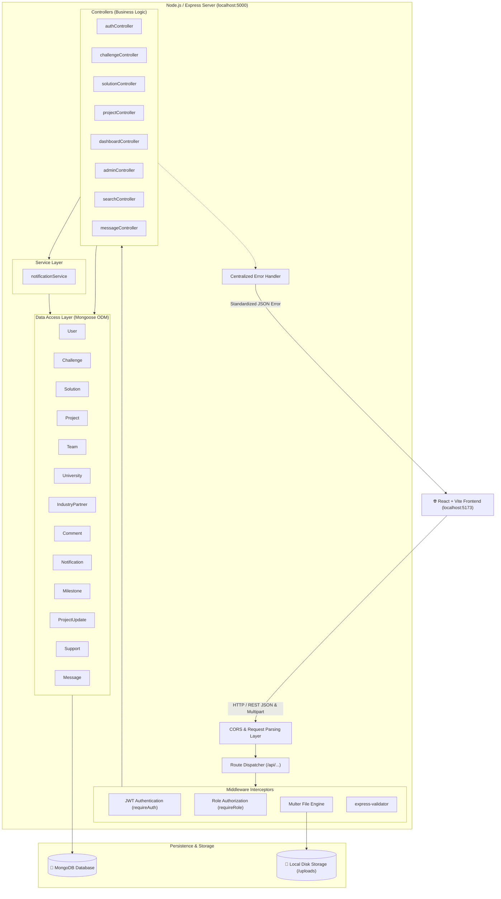
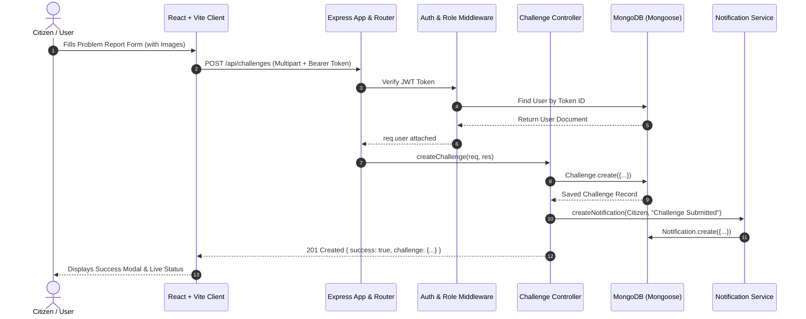
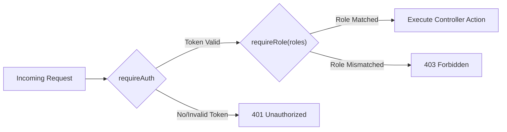
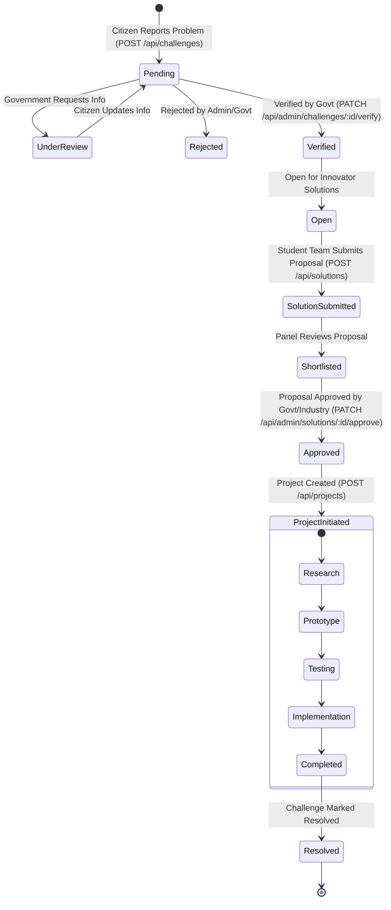
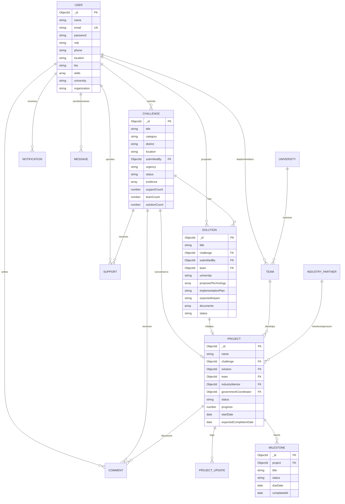

# 🏛 Samadhan Connect — Backend Architecture

> **Architectural Blueprint & Design Specification**  
> Comprehensive technical guide to the design patterns, system layers, data flows, security pipelines, and entity relationships powering the Samadhan Connect REST API.

---

## 📑 Table of Contents
1. [Architecture Overview](#1-architecture-overview)
2. [Layered System Architecture](#2-layered-system-architecture)
3. [End-to-End System Data Flow](#3-end-to-end-system-data-flow)
4. [Authentication & Authorization Pipeline](#4-authentication--authorization-pipeline)
5. [Societal Problem-to-Solution Lifecycle](#5-societal-problem-to-solution-lifecycle)
6. [Database Schema & ER Relationships](#6-database-schema--er-relationships)
7. [Security & Error Handling Architecture](#7-security--error-handling-architecture)
8. [File Storage & Static Asset Delivery](#8-file-storage--static-asset-delivery)

---

## 1. Architecture Overview

Samadhan Connect uses a **Modular Model-View-Controller (MVC) Pattern** coupled with a **Layered Service Architecture**. The backend exposes a stateless RESTful JSON API engineered to communicate seamlessly with modern SPA frontends (React + Vite).



---

## 2. Layered System Architecture

The backend enforces strict separation of concerns across 6 distinct layers:

```
┌─────────────────────────────────────────────────────────────┐
│ 1. Network & Client Layer (CORS, JSON Body, URL Encoded)   │
├─────────────────────────────────────────────────────────────┤
│ 2. Routing Layer (API Versioning, Route Handlers)          │
├─────────────────────────────────────────────────────────────┤
│ 3. Interceptor Layer (JWT Auth, RBAC, Multer, Validators)   │
├─────────────────────────────────────────────────────────────┤
│ 4. Controller Layer (Request Extraction, Business Workflow) │
├─────────────────────────────────────────────────────────────┤
│ 5. Service Layer (Notifications, Cross-Cutting Helpers)     │
├─────────────────────────────────────────────────────────────┤
│ 6. Persistence Layer (Mongoose Models, Indexes, MongoDB)    │
└─────────────────────────────────────────────────────────────┘
```

### Layer Details:
1. **Network Layer (`server.js`, `src/app.js`)**:
   - Manages HTTP connection lifecycle, port binding, and unhandled promise/exception traps.
   - Configures CORS origins specifically enabling `http://localhost:5173` (Vite) and development tools.
   - Hosts static uploads route via `express.static('/uploads')`.

2. **Routing Layer (`src/routes/*.js`)**:
   - Decoupled endpoint routers for 15 functional domains.
   - Maps endpoints cleanly to controller handlers with express-validator arrays.

3. **Interceptor Layer (`src/middleware/*.js`)**:
   - `auth.js`: Verifies Bearer tokens, resolves User identity, and attaches `req.user`.
   - `role.js`: High-order authorization guard enforcing access constraints across roles.
   - `upload.js`: Multipart parser validating MIME types (images, videos, documents, presentations) and file size (50MB).
   - `validate.js`: Intercepts validation errors and formats JSON responses.

4. **Controller Layer (`src/controllers/*.js`)**:
   - Handles parameter parsing, database transactions, authorization checks, and standard JSON response envelopes.

5. **Service Layer (`src/services/*.js`)**:
   - Encapsulates side-effects like automated in-app notifications on workflow milestones.

6. **Data Access Layer (`src/models/*.js`)**:
   - Mongoose schemas with field-level validations, text indexes, compound unique constraints, and schema virtuals.

---

## 3. End-to-End System Data Flow



---

## 4. Authentication & Authorization Pipeline

### JWT Authentication Flow
1. User logs in with `email` and `password` at `POST /api/auth/login`.
2. Password is verified using `bcryptjs.compare()` against the salt hash.
3. Upon success, a signed JWT token containing `{ id: user._id, role: user.role }` is generated with a 30-day expiration.
4. Client stores the token in `localStorage` and includes it in subsequent requests via header:
   `Authorization: Bearer <token>`
5. `requireAuth` extracts and verifies the token, attaching the sanitized user object (excluding password) to `req.user`.

### Role-Based Access Control (RBAC) Matrix



| Role | Permitted Actions |
| :--- | :--- |
| **`citizen`** | Report problem challenges, upload evidence, upvote challenges, comment, manage profile, direct message. |
| **`student`** | Join challenges, create & manage student teams, submit solution proposals with blueprints, log project milestones. |
| **`university`** | Manage university profile, faculty mentorship, oversee student innovator teams, track campus IP & projects. |
| **`industry`** | Browse verified challenges, sponsor hardware prototypes, mentor student teams, provide CSR funding. |
| **`government`** | Review pending challenges, verify/reject issues, request citizen info, approve solutions for project deployment, view state analytics. |
| **`admin`** | Full super-admin privileges across all 13 collections, user management, and platform analytics. |

---

## 5. Societal Problem-to-Solution Lifecycle



---

## 6. Database Schema & ER Relationships



---

## 7. Security & Error Handling Architecture

### Centralized Error Handler (`src/middleware/errorHandler.js`)
All synchronous and asynchronous controller errors pass automatically to the centralized handler:

| Error Type | Trigger Condition | Status Code | Returned JSON Message |
| :--- | :--- | :---: | :--- |
| **CastError** | Invalid MongoDB ObjectId in request URL (`/api/challenges/123`) | `404 Not Found` | `Resource not found with ID of ...` |
| **DuplicateKey (11000)** | User tries to register existing email or duplicate unique name | `409 Conflict` | `Duplicate value entered for email...` |
| **ValidationError** | Mongoose schema validation failure (e.g. missing required field) | `400 Bad Request` | Extracted schema validation error messages |
| **JsonWebTokenError** | Malformed or tempered JWT token | `401 Unauthorized` | `Invalid authentication token` |
| **TokenExpiredError** | Expired JWT token | `401 Unauthorized` | `Authentication token has expired. Please log in again.` |
| **MulterError** | Upload size exceeded (>50MB) or unexpected multipart field | `400 Bad Request` | `File upload error: ...` |

---

## 8. File Storage & Static Asset Delivery

```
backend/
└── uploads/                   <-- Local disk destination
    ├── evidence_palamu-1725184.jpg
    ├── technical_blueprint-1725185.pdf
    └── video_evidence-1725186.mp4
```

1. **Multer Engine**: Files uploaded through `multipart/form-data` are sanitized, given a collision-resistant timestamp suffix, and stored in `backend/uploads/`.
2. **Static Route**: Served publicly via `http://localhost:5000/uploads/<filename>`.
3. **Database Representation**: Stored as structured metadata inside arrays:
   ```json
   {
     "url": "/uploads/evidence_palamu-1725184.jpg",
     "fileType": "image",
     "originalName": "palamu_water_sample.jpg"
   }
   ```
